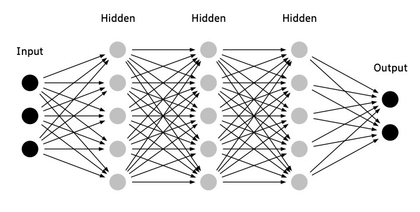

# Create a drawing of a feed-forward neural network.

This is a simple Python script to generate pictures of a feed-forward neural network using Python and Graphviz. This is heavily inspired by Thiago G. Martins [How to draw neural network diagrams using Graphviz](https://tgmstat.wordpress.com/2013/06/12/draw-neural-network-diagrams-graphviz/).

## Usage
 
Pipe to Preview in Mac OS X.

```
python dotnets.py | dot -Tpng | open -f -a /Applications/Preview.app
```

Or generate a PDF

```
python dotnets.py | dot -Tpdf > test.pdf
```

## Example




